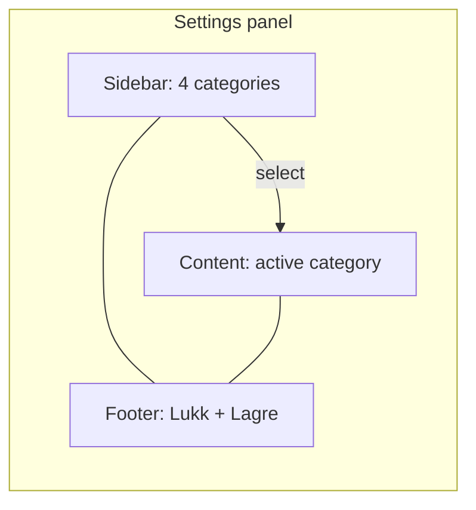

# Settings Sidebar Tabs - Plan

## Goal Capsule

- **Objective:** Replace the single scrolling settings form with a ChatGPT-style two-pane layout (category sidebar + content pane) so adults can find settings without scrolling through every section.
- **Product authority:** This Product Contract. Existing settings fields, PIN gate, and save semantics stay as today unless overridden below.
- **Open blockers:** None.
- **Execution:** code

## Product Contract

### Summary

Settings opens as a two-pane panel: a left sidebar lists the four existing categories; the right pane shows only the selected category’s fields. One global Lagre/Lukk footer covers all tabs. Visual structure follows ChatGPT settings; colors and type stay Safe Home.

### Problem Frame

Settings already has four distinct sections in one scroll. As more options land, a flat form becomes hard to scan. Adults need a clear category map without changing what each setting does.

### Key Decisions

- **KD1. ChatGPT-style left sidebar** over top tabs or hybrid. Scales as categories grow. (session-settled: user-directed — chosen over top tabs / hybrid: matches the ChatGPT screenshot the user shared)
- **KD2. One sidebar item per existing section** — Tid og spill, PIN-kode, Windows, App-versjon — no regrouping. (session-settled: user-directed — chosen over regrouping: keeps familiar labels and field groups)
- **KD3. Global Lagre/Lukk** — edits on every tab stay in memory until Lagre writes all, or Lukk discards all. Prefer continuity with today’s save model over ChatGPT-style auto-save. (session-settled: user-approved — agent chose after user said decide the rest)
- **KD4. Icons beside category labels** for quick scanning. (session-settled: user-approved — agent chose after user said decide the rest)
- **KD5. First-run setup panel stays a single scroll** — out of scope for this change. (session-settled: user-approved — agent chose after user said decide the rest)
- **KD6. Safe Home visual language** — reuse existing tokens and card chrome; adopt ChatGPT’s two-pane structure only, not their colors or density.

### Requirements

**Layout and navigation**

- R1. After PIN unlock, settings shows a left category sidebar and a right content pane inside the existing settings panel.
- R2. Sidebar lists exactly four categories in this order: Tid og spill, PIN-kode, Windows, App-versjon.
- R3. Each sidebar item shows an icon and the category label; the active item is visually distinct.
- R4. Selecting a category shows that category’s fields in the content pane and hides the others.
- R5. Opening settings selects Tid og spill by default.
- R6. The content pane header names the active category.

**Fields and persistence**

- R7. Each category contains the same fields and helper copy as today’s matching section; no new settings fields in this work.
- R8. Switching categories keeps unsaved edits in memory for all categories until Lagre or Lukk.
- R9. Lagre and Lukk remain a single global footer (not per category); Lagre persists all categories; Lukk discards unsaved changes and closes settings as today.
- R10. PIN gate, tray/gear entry points, and closing settings without quitting the app behave as today.

**Presentation**

- R11. Layout uses Safe Home styling tokens and fits the existing settings-active card; it does not adopt ChatGPT brand chrome.
- R12. Category navigation is keyboard-accessible (focusable items; clear selected state).

### Key Flows

- F1. Open settings and change across tabs
  - **Trigger:** Adult opens settings (gear / tray / open-settings) and passes the PIN gate.
  - **Steps:** Panel opens on Tid og spill; adult edits fields; switches to other categories and edits; presses Lagre.
  - **Outcome:** All in-memory edits persist; success feedback as today.
  - **Covered by:** R1–R10

- F2. Discard without saving
  - **Trigger:** Adult has unsaved edits on one or more categories and presses Lukk (or equivalent cancel).
  - **Outcome:** No settings write; panel closes; next open shows last saved values.
  - **Covered by:** R8, R9

### Acceptance Examples

- AE1. Cross-tab save
  - **Covers:** R4, R8, R9
  - **Given:** Adult changes grant minutes on Tid og spill and toggles autostart on Windows without saving.
  - **When:** Adult presses Lagre.
  - **Then:** Both changes are persisted.

- AE2. Discard across tabs
  - **Covers:** R8, R9
  - **Given:** Adult changes HUD hotkey on Windows, switches to PIN-kode, leaves PIN blank.
  - **When:** Adult presses Lukk.
  - **Then:** Hotkey is unchanged on next open.

- AE3. Default category
  - **Covers:** R5, R6
  - **Given:** Adult opens settings after PIN unlock.
  - **When:** Panel appears.
  - **Then:** Tid og spill is selected and its fields are visible.

### Success Criteria

- SC1. An adult can reach any of the four categories in one click/tap without scrolling past unrelated fields.
- SC2. Save and cancel behavior matches today’s mental model (one Lagre, one Lukk) with no lost edits when switching tabs before Lagre.
- SC3. First-run setup and PIN gate remain unchanged.

### Scope Boundaries

**In scope**

- Two-pane navigation chrome for the post-PIN settings panel
- Mapping existing sections to four sidebar categories
- Icons, active state, default category, global footer save/discard

**Out of scope**

- First-run setup panel tabs
- New settings fields (including language)
- Auto-save or per-tab Lagre
- Redesign of PIN gate, lock screen, or garage shop tabs
- Matching ChatGPT colors, typography, or modal chrome

### Assumptions

- A1. Desktop lock-screen card width remains enough to show sidebar + content side by side; no mobile collapse pattern is required for v1.
- A2. Simple iconography (inline SVG or equivalent) is acceptable; no icon pack dependency is required by this contract.

### Outstanding Questions

None — remaining product choices were delegated to the agent and recorded under Key Decisions.
